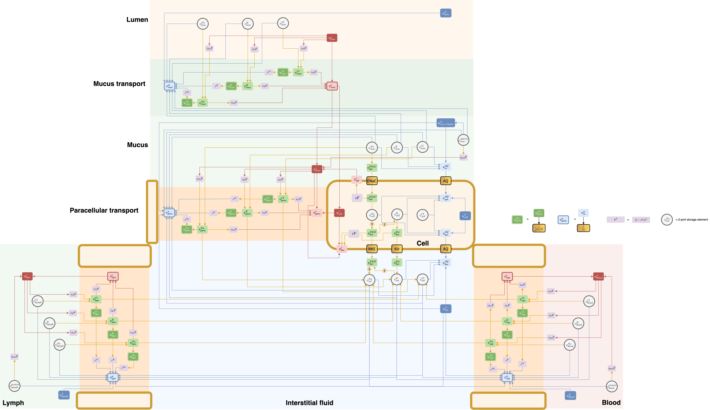
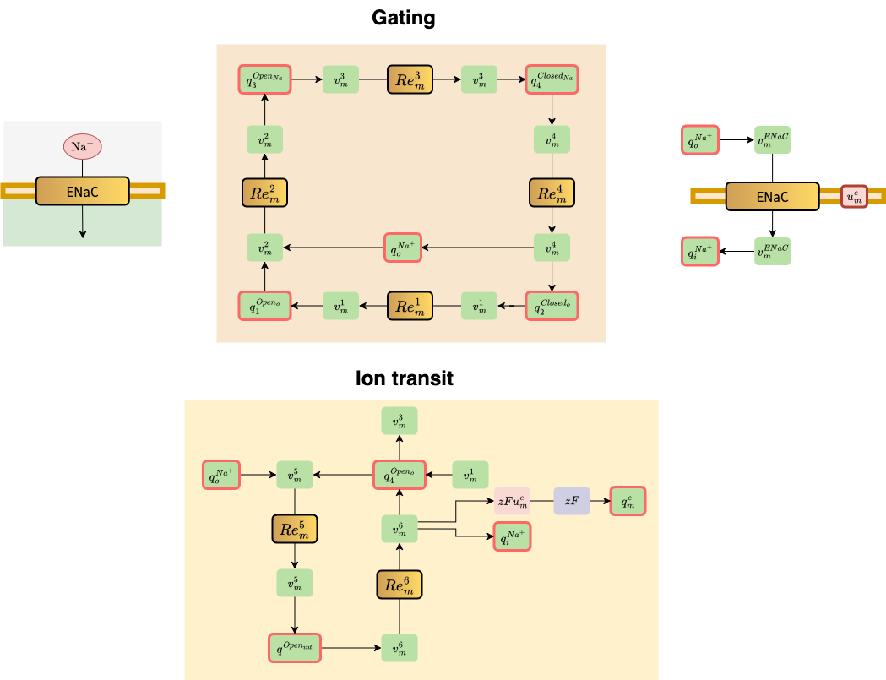
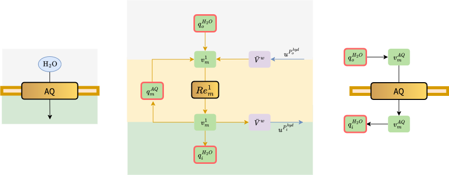
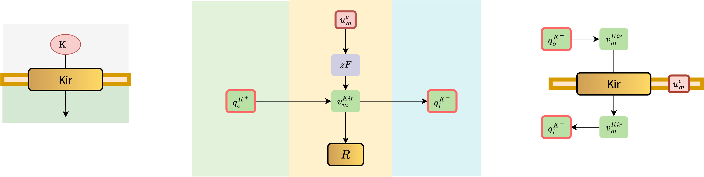

# Colon ion and fluid transport FTU
This project contains the CellML bond graph modules and circulatory autogen input files for generating a functional tissue unit (FTU) of ion and fluid transport in the distal colon. 

# Overview

## Full model


## Modules

### Proteins
#### Epithelial Sodium Channel (ENaC)


#### Na/K-ATPase


#### Aquaporin


#### K-leak channel


# How to use

## Circulatory autogen installation
This project uses the model generation capabilities of [Circulatory autogen](https://github.com/FinbarArgus/circulatory_autogen/tree/master) to couple modules into the distal colon FTU. Follow the [getting started](https://github.com/FinbarArgus/circulatory_autogen/blob/master/tutorial/docs/getting-started.md) documentation to install circulatory autogen. As part of this process, you will install OpenCOR, which will be used to run the generated FTU.

## Update paths
Before running circulatory autogen, open the file: 

circulatory_autogen > user_run_files > user_inputs.yaml 

and update:

user_inputs_path_override: [colon_FTU_dir]/CA_colon_FTU/colon_FTU_user_inputs.yaml

## Generating the functional tissue unit
After updating modules, parameters, or the vessel array, it will be necessary to regenerate the functional tissue model. To do so, Navigate to the user_runs_files directory 


 and run the following command 

```
 ./run_autogeneration.sh
```

# Directory structure

```
├── CA_colon_FTU
│   ├── colon_FTU_user_inputs.yaml
│   ├── generated_models
│   └── resources
├── CA_colon_FTU_simple
│   ├── colon_FTU_user_inputs.yaml
│   ├── generated_models
│   └── resources
├── LICENSE
├── README.md
├── model_visualisations
│   ├── BG_AQ.png
│   ├── BG_ENaC.png
│   ├── BG_Hunter_NKE.png
│   ├── BG_Kir.png
│   ├── CA_colon_FTU.png
│   └── CA_colon_FTU_simple.png
└── modules
    ├── BG_AQ.cellml
    ├── BG_ENaC.cellml
    ├── BG_ENaC_SS.cellml
    ├── BG_Kir.cellml
    ├── NKE_pump_BG_6_states_v2.cellml
    ├── NKE_pump_SS_BG_6_states_v1.cellml
    ├── colon_FTU_module_config.json
    ├── colon_FTU_modules.cellml
    ├── coupled_solute_solvent_transport.cellml
    ├── epithelial_dynamics.cellml
    └── units_and_constants

10 directories, 20 files
```
# Citation
*Insert journal citations when this model is published.*

# Acknowledgement
This work was funded by the Auckland Bioengineering Insitute 12 Labours project grant from the Ministry of Business Innovation and Employment’s Catalyst: Strategic fund. 

# License


# Contact
If you're interested in collaborating or have any questions about the model, please contact j.dowrick@auckland.ac.nz
